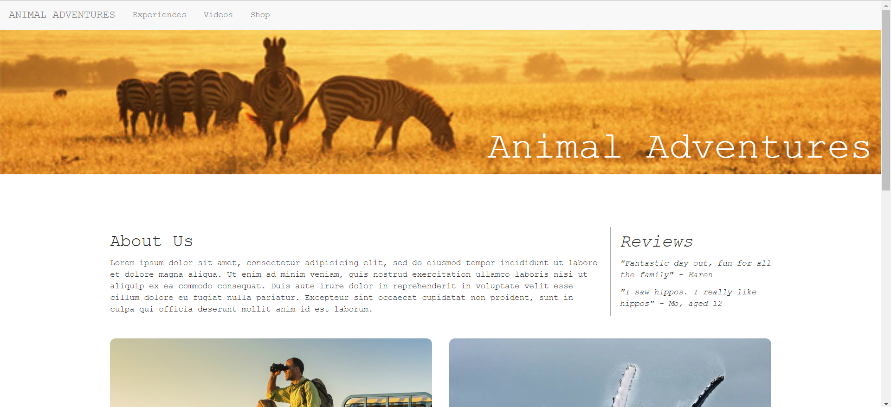

# Animal Adventures Website

I was tasked with making a website for a company called Animal Adventures, in order to promote their services and goods. The site contains a home page, a page showing the adventures that the company offers, a videos page and a shop page. It is responsive on desktop, tablet and mobile.

## How To Access The site

The site can be found at:
https://matrbeales.github.io/week-2-project/
